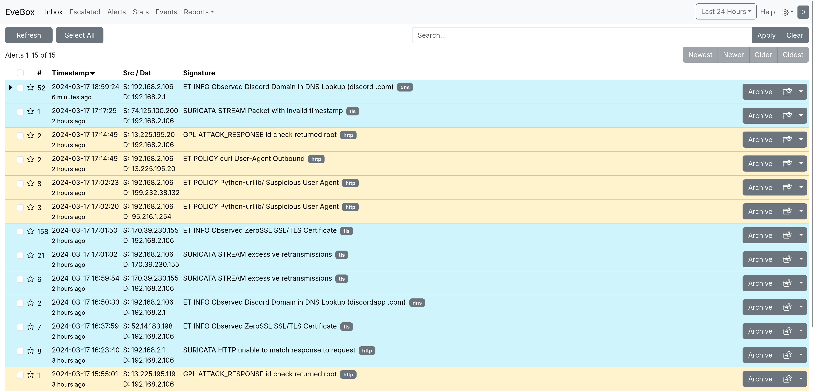

import ExampleHardware from '../assets/secureswitch-example-hardware.webp';

# Server Role: SecureSwitch
The `secure-switch-appliance` role configures a ProLinux Server with multiple NICs as a switch that passes traffic through [Suricata](https://suricata.io/), for Intrusion Detection and Prevention (IPS/IDS).

## Prerequisites
Your SecureSwitch requires at least 2 network interfaces. Additionally, running additional services on a ProLinux 2 Server machine configured wit the SecureSwitch role is not recommended.

Your SecureSwitch can sit anywhere on the network (it will analyze any traffic flowing over the bridge network). If you want to secure your entire network, place it between your router and the rest of your LAN devices (note that if your router has built-in WiFi, that will not be protected. A dedicated AP downstream of the SecureSwitch will work).

:::tip

You can find off-the-shelf router Mini PCs with embedded hardware, like this one capable of 2.5Gbps routing for around $200:

:::


## Installation

To install the SecureSwitch role, run the following command:

```bash
plctl server enable secure-switch-appliance
```
then run `sudo reboot`

Note that your server's IP will change. Currently the SecureSwitch appliance only supports using DHCP to get a management IP.

## Uninstallation

To uninstall the SecureSwitch role, run the following command:

```bash
plctl server disable secure-switch-appliance
```
then run `sudo reboot`

## Access and Configuration
You can view IDS/IPS alerts and events from the Evebox web interface. To access it, use SSH port forwarding to acesss port 5636 on your ProLinux Server.

```bash
ssh -L 5636:localhost:5636 user@<server>
```

Then open your web browser and go to `http://localhost:5636`.



Suricata configuration is located at `/sineware/data/server/secure_switch/etc`, logs at `/sineware/data/server/secure_switch/logs`, and rules at `/sineware/data/server/secure_switch/rules`. 

If you want to restart Suricata, use the following command:

```bash
sudo podman restart PLINTERNAL_secure-switch-appliance_surciata
```
