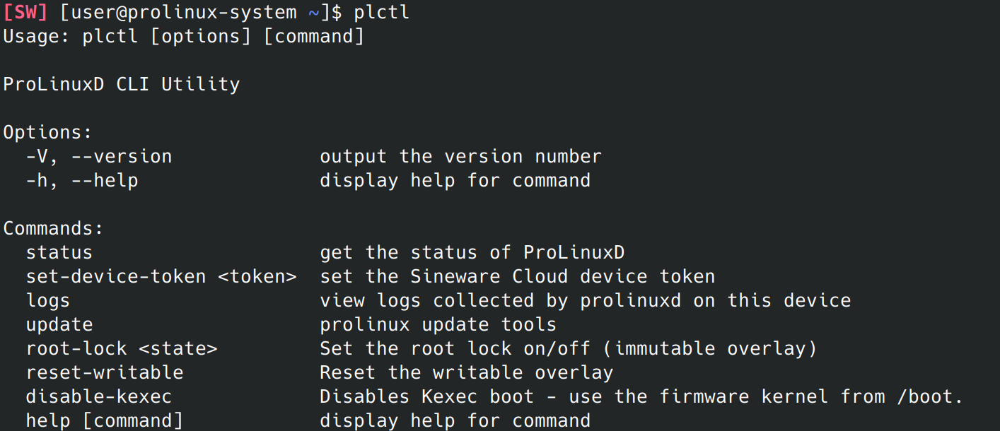

# Using ProLinux

## Installing Apps

Apps on ProLinux are installed using [Flatpak](https://flatpak.org/), a universal package manager and sandboxed software runtime.

You can use the Flatpak CLI (from [Flathub](https://flathub.org/en), the default repository) to install apps, or install them using the Discover app.

## Command Line
`plctl` is the main command that interacts with ProLinuxD to modify the system configuration.

